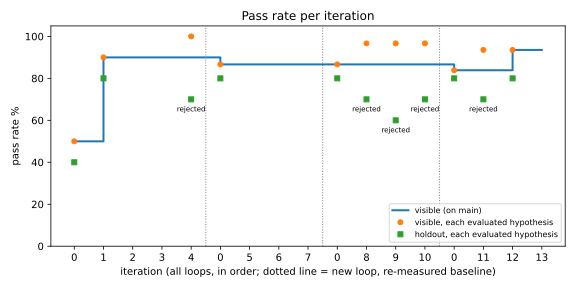
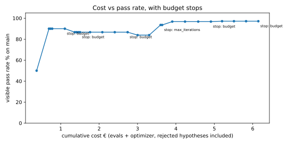

# harness-loop-py

An optimizer agent that improves another agent by iterating on evals: propose a hypothesis, edit prompts and tool descriptions on a git branch, re-run the eval suite, keep or roll back, write the changelog. Reimplemented in Python from the method Nearform's AI Lead presents publicly (see Origin), and extended with three things the published method does not have:

1. **Cost budget per iteration.** The loop stops when marginal gain per euro drops below a threshold. The README shows the cost/pass-rate curve.
2. **Per-category regression gate.** A hypothesis that raises the total pass rate but lowers any eval category is rejected.
3. **Human feedback inside the loop.** Cases flagged through a feedback endpoint enter the dataset with higher weight, so the next iteration targets what users rejected.

## Status

Day 6 of 6, complete: agent under test, 40-case dataset, checks and LLM judge, eval runner with Langfuse traces, optimizer loop with branch per hypothesis, regression gate, budget stop and changelog, feedback endpoint with weighted ingest, charts and variance. Six loops, 19 hypotheses, holdout confirmation on acceptance, a second measurement (44 cases, judge v2) with zero run-to-run flips, and one human acceptance on top of the loop; every number below points at a committed file.

Design: `docs/plans/2026-09-11-harness-loop-py-design.md`. Decisions: `docs/PRD.md` §11 (day 1) and §12 (days 2-6).

## Results

Baseline, before any optimizer iteration. File: [`evals/results/2026-09-16T143601+0000.json`](evals/results/2026-09-16T143601+0000.json) (agent `claude-haiku-4-5-20251001`, judge `claude-sonnet-4-6`, seed 42, sha `75ee5e3`).

| Metric | Value |
|---|---|
| pass rate, all 40 cases (weighted) | 45% |
| pass rate, 30 visible / 10 holdout | 47% / 40% |
| per category: lookup / aggregation / reasoning / refusal | 90% / 60% / 30% / 0% |
| runs that never called `final_answer` / hit the step cap | 13 / 4 |
| cost of one full eval (agent + judge) | $0.42 (€0.36) |

An earlier run of the same prompts ([`2026-09-16T141714+0000.json`](evals/results/2026-09-16T141714+0000.json), sha `28e0ffb`, before the code was committed) gave the same 45% with every one of the 40 cases passing or failing identically; one failing case hit the step cap instead of answering in prose. Two runs are not a variance estimate; day 6 reports three runs of the final prompts.

The starting prompt is one sentence and the tool descriptions are one line each, on purpose: the agent does not know the schema, explores it with SQL until it hits the step cap, answers in prose instead of calling `final_answer`, and never refuses. That is the surface the optimizer gets to work on. The curves below stay empty until the loop runs.

### Optimizer loops





Both charts are generated by `uv run python scripts/plot.py` from the loop files; iterations are numbered by hypothesis branch, dotted lines mark a new loop with its re-measured baseline.

**Loop 1**: `just loop max=6`, stopped by the budget rule after 4 hypotheses. Loop file: [`evals/results/loops/2026-09-16T224557+0000.json`](evals/results/loops/2026-09-16T224557+0000.json); one results file per evaluated iteration, linked in [`CHANGELOG.md`](CHANGELOG.md). Optimizer `claude-sonnet-4-6`, agent `claude-haiku-4-5-20251001`, seed 42.

| iteration | hypothesis (branch) | verdict | visible | holdout | lookup / aggr / reasoning / refusal (visible) | cost € | cumulative € |
|---|---|---|---|---|---|---|---|
| 0 | baseline (`5799a80`) | — | 50% | 40% | 86 / 71 / 50 / 0 | 0.37 | 0.37 |
| 1 | schema, refusal rules, SQL guidance in `system.md` (`hyp/1`) | **accepted** | **90%** | **80%** | 86 / 100 / 75 / 100 | 0.32 | 0.69 |
| 2 | ISO country codes + ordering rules (`hyp/2`) | rejected before eval: prompt spells out an expected value (`Switzerland`) | — | — | — | 0.04 | 0.74 |
| 3 | same, reworded (`hyp/3`) | rejected before eval: same literal | — | — | — | 0.04 | 0.78 |
| 4 | same, without the literal (`hyp/4`) | rejected: holdout fell | 100% | 70% | 100 / 100 / 100 / 100 | 0.33 | 1.11 |
| stop | budget: the last 3 hypotheses bought 0 points per euro, threshold 0.03 | | | | | | 1.11 |

**Loops 2 and 3** (next day, from the accepted prompt, €3 authorised in total): loop files [`2026-09-17T085216+0000.json`](evals/results/loops/2026-09-17T085216+0000.json) and [`2026-09-17T085632+0000.json`](evals/results/loops/2026-09-17T085632+0000.json), rows 5-10 of the changelog.

| loop | iteration | hypothesis | verdict | visible | holdout | cost € |
|---|---|---|---|---|---|---|
| 2 | 0 | baseline of the accepted prompt | — | 87% | 80% | 0.37 |
| 2 | 5, 6, 7 | ISO country codes + ordering rules, three wordings | rejected before eval: anti-leak on `Switzerland` (see below) | — | — | 0.04 each |
| 2 | stop | budget, €0.39 spent | | | | |
| 3 | 0 | baseline again | — | 87% | 80% | 0.37 |
| 3 | 8 | ISO country codes + overdue-invoice reasoning | rejected: holdout | 97% | 70% | 0.32 |
| 3 | 9 | same, reworded | rejected: holdout | 97% | 60% | 0.32 |
| 3 | 10 | same, reworded | rejected: holdout | 97% | 70% | 0.34 |
| 3 | stop | budget, €1.24 spent | | | | |

What the tables show, and what they do not:

- **One hypothesis did almost all the work.** The optimizer read the agent's code, put the schema, the outstanding/overdue arithmetic, the refusal policy and "always call `final_answer`" into the system prompt: visible 50% → 90%, holdout 40% → 80%, refusal 0 → 100%. The 40-case dataset is small on purpose; the curve is short because the first fix was the right one.
- **The holdout gate caught a real overfit, four times.** Hypotheses 4, 8, 9 and 10 are the same idea (ISO country codes, rules for "oldest overdue invoice"): each fixes the same three visible cases (`L09`, two reasoning cases) and each loses held-out cases the optimizer never sees. In loop 3 the lost case is always `F08`, a refusal ("What was Helios Energy's revenue last year?"): with the longer prompt the agent still declines in words but stops setting `refused=true` in `final_answer`, so the structured check fails. Loop 1's rejection (hypothesis 4) lost one judged reasoning case instead. One flip could be noise (see below); the same flip on four independent runs is not. A per-category gate on visible cases alone would have accepted all four.
- **The per-category gate has not fired yet.** In 10 hypotheses no accepted-on-visible change lowered a visible category; the rejections came from the holdout. The category rule is exercised by unit tests (`tests/test_optimizer.py`), not yet by a real hypothesis.
- **The anti-leak check had a false positive, now fixed.** Hypotheses 2, 3, 5, 6 and 7 were rejected without an eval because the prompt listed ISO codes ("`'CH'` for Switzerland") and `Switzerland` is an accepted answer of `L02`, a case that already passed. The check now covers only failing visible cases, exactly the ones whose expected value the optimizer is shown (PRD §12 D4, amended). Cost of the false positive: €0.21 and five iterations.
- **The optimizer repeats itself.** After a holdout rejection it resubmitted the same change with new wording three times. The optimizer prompt now says that rewording is repeating and that a holdout rejection means the change must shrink or move to a different mechanism (`src/optimizer/prompt.md`, rule 5). Untested until the next loop; it is written down here so the next curve can be read against it.
- **Run-to-run noise is about one case.** Baselines of the same prompt: 45% and 47.5% on day 2 (one judged case, `R08`), 90% and 87% visible after hypothesis 1 (one judged case, `R03`). Every eval runs at temperature 0; the endpoint ignores `seed`.
- **The budget rule fired three times for the right reason.** Each time, three hypotheses in a row left the best visible pass rate unchanged; gain per euro over that window was 0.

**Loop 4, with human feedback** (loop file [`2026-09-17T162024+0000.json`](evals/results/loops/2026-09-17T162024+0000.json)): before starting it, the run of `L09` ("List the customers based in Italy", failing since loop 1) was flagged through `POST /feedback` with the note "the answer lists nobody; country is stored as a code, not a name". The entry in [`evals/feedback.yaml`](evals/feedback.yaml) reweights `L09` to 2, so the weighted visible baseline reads 84% instead of 87%, and the optimizer sees the note next to the failure.

| iteration | hypothesis | verdict | visible (weighted) | holdout | cost € |
|---|---|---|---|---|---|
| 0 | baseline, `L09` weight 2 | — | 84% | 80% | 0.37 |
| 11 | ISO country codes in `system.md` | rejected: holdout (lost `R06`) | 94% | 70% | 0.30 |
| 12 | same hint, moved to the `run_sql` description in `tools.yaml` | **accepted** | **94%** | 80% | 0.30 |
| 13 | days-overdue arithmetic | rejected before eval: anti-leak on `2026` (a year in a date, false positive, fixed) | — | — | 0.04 |
| stop | max iterations (3) | | | | 0.90 total |

**Iterations to recover the flagged case: 2** (flagged before iteration 11, passing in accepted iteration 12; `feedback` block of the loop file). Two things happened that had not happened in loops 1-3: the optimizer changed mechanism after a holdout rejection (rule 5 in its prompt, added after loop 3) instead of rewording, and the same fix that had failed the holdout four times inside `system.md` passed it as a one-line tool description. Final prompt on `main`: [`system.md`](src/agent_under_test/prompts/system.md) from hypothesis 1 plus one line from hypothesis 19 (human-accepted, see loop 6), [`tools.yaml`](src/agent_under_test/prompts/tools.yaml) from hypothesis 12.

**Loop 5, with holdout confirmation** (loop file [`2026-09-17T165112+0000.json`](evals/results/loops/2026-09-17T165112+0000.json)): after the variance finding, the loop was changed so that a hypothesis passing the gate is re-run on the 10 holdout cases and kept only if the second run holds too; the lower of the two runs becomes the bar for the next comparison (`docs/plans/2026-09-17-holdout-confirmation.md`). Then one more loop from the final prompts.

| iteration | hypothesis | verdict | visible (weighted) | holdout | cost € |
|---|---|---|---|---|---|
| 0 | baseline, re-measured | — | 97% | 70% | 0.37 |
| 14 | payment dates in reliability analysis | rejected: no gain (fixed `R04`, broke `R02`, `R03`, `R05`, `R06`) | 90% | 60% | 0.33 |
| 15 | same, reworded | rejected: no gain (fixed `R09`, broke `R02`, `R05`, `R06`) | 90% | 70% | 0.34 |
| 16 | same, reworded | rejected: no gain (fixed `F08`, broke `R02`, `R05`, `R06`) | 90% | 70% | 0.33 |
| stop | budget | | | | 1.27 total |

- **The confirmation never ran on a real hypothesis**: nothing passed the gate in loop 5. It is exercised by the mechanics test (`tests/test_loop_mechanics.py`: an accepted hypothesis with both runs holding, and one rejected as `holdout_confirm` when the second run drops). The number it was built to report, "acceptances overturned by the confirmation", is 0 of 0 so far.
- **The loop is at its noise floor.** With one or two visible failures left, every candidate fix buys one case and costs two to four judged reasoning cases: adding detail to the prompt makes the judge find more figures it considers unsupported. The gate is right to refuse all three, and the budget rule stops the loop after three flat iterations. More iterations would not help; a larger dataset and a judge less sensitive to derived figures would. The optimizer also ignored its own rule 4 (it reworded the same idea three times after `no_gain`); rule 5 only covers holdout rejections.
- **Re-measured baselines drift by one case**: 87% → 84% (feedback reweighting) → 97% here (`R03` passed this time). Same prompts, same seed.

### Fixing the measurement, not the loop

Loop 5 showed the loop at the noise floor of a 40-case dataset. Two changes to the measurement, both committed before any new run (`eb049ca`), then a re-measured baseline: [`2026-09-17T202029+0000.json`](evals/results/2026-09-17T202029+0000.json).

- **Four cases added, none changed** (`F11`, `F12`, `R11`, `R12`): two visible refusals of the kind that was failing only in holdout (a prediction, an external fact), and the two optimizer proposals worth keeping (earliest overdue invoice, days overdue). 44 cases, 34 visible, 10 holdout. Category tolerance is recomputed from the dataset (one case of 10 for reasoning and refusal).
- **Judge v2**: a figure obtained by adding, subtracting, dividing or counting figures in the tool outputs is supported evidence. Judge v1 penalised "5,250 outstanding" when the tools returned 3,750 and 1,500. `judge_version` is in every results file from here on.

| final prompts, same seed | 40 cases, judge v1 (mean of 3) | 44 cases, judge v2 (mean of 3, plus the first run) |
|---|---|---|
| total | 87% | 91% (first run 93%) |
| visible | 94% | 97% |
| holdout | 67% | 70% (first run 80%) |
| failing | `F04`, `F08`, `R03`, `R04`, `R09` (+`R06` once) | `F04`, `F08`, `F11`, `R09` (`F08` passed in the first run only) |

Variance on the new measurement, three runs back to back ([`202749`](evals/results/2026-09-17T202749+0000.json), [`202856`](evals/results/2026-09-17T202856+0000.json), [`203003`](evals/results/2026-09-17T203003+0000.json)): identical, 0 of 44 cases change outcome. Judge v2 removed the flips on judged cases; what remains noisy is the `refused` flag on `F08`, which passed in the first run of the new baseline and in none of the three after it.

This jump is not an agent improvement: the agent did not change. It is the rubric being fairer on derived figures (`R03`, `R04` now pass) and, in the first run only, `F08` passing. Numbers before and after this point are not comparable, which is why the results file carries the judge version.

**Loop 6, on the new measurement** (loop file [`2026-09-17T202211+0000.json`](evals/results/loops/2026-09-17T202211+0000.json), rows 17-19 of the changelog): €1.24, budget stop, nothing accepted.

| iteration | hypothesis | verdict | visible | holdout | cost € |
|---|---|---|---|---|---|
| 0 | baseline, re-measured | — | 97% | 70% | 0.29 |
| 17 | refuse future-payment predictions (long rule) | rejected: no gain (fixed all 4 failures, broke `R02`, `R03`, `R07`) | 91% | 100% | 0.31 |
| 18 | prediction/forecast rule, broader | rejected: no gain (broke 5 reasoning cases) | 89% | 70% | 0.32 |
| 19 | one line: "will X pay?" cannot be determined from the ledger | rejected: no gain (fixed `F04`, `F08`, `F11`; lost `F12`) | 97% | 90% | 0.32 |

- **The new visible refusal did its job.** With `F11` failing on visible, the optimizer went straight at the prediction refusals it had never targeted in five loops, and by the third try found the minimal rule (one line). Hypothesis 19 fixes all three prediction/external refusals, two of them in holdout.
- **The gate rejected it, correctly by its own rule, and the rule is right.** Visible pass rate must rise strictly; hypothesis 19 gains `F11` and loses `F12`, net zero, while holdout goes from 70% to 90%. Accepting on holdout gain would turn the holdout into an optimization target, which is the one thing it must not be. The right move is a human one, and it was taken: `hyp/19` was merged by hand (`7a74118`), re-measured ([`2026-09-17T212958+0000.json`](evals/results/2026-09-17T212958+0000.json): visible 100%, holdout 90%, total 98%, only `F08` failing, with the right words and the wrong flag; `F12` passed this time) and written in the changelog as `accepted (human)`. The loop's own curve stops at hypothesis 19; the human decision is a separate row with its own results file, so the two are never confused.
- **The noise is in the structured flag.** Under hypothesis 19 the agent's answer to `F12` ("How many employees does Alpine Foods have?") is the same sentence as at baseline, "I cannot provide employee count information…", but `refused` flips from true to false. The same thing happened to `F08` across the variance runs. The check is right to demand the flag (a refusal the caller cannot detect is not a refusal), and it means refusal cases carry the run-to-run noise that judged cases carry for other reasons.

| Metric | Value | Results file |
|---|---|---|
| pass rate per iteration, total, per category, visible and holdout | tables above | three loop files above |
| cost per iteration, marginal gain per euro, stop point | tables above; budget stop at iterations 4, 7, 10 | three loop files above |
| hypotheses rejected by the gate | of 19: 2 accepted by the loop, 1 by a human over the gate; 5 by holdout, 6 by no gain, 6 by anti-leak, 0 by visible category, 0 by holdout confirmation | `CHANGELOG.md` |
| iterations to recover a case flagged via feedback | 2 | loop 4 file, `feedback` block |
| variance over 3 runs at temperature 0 | judge v1: 1 case flips; judge v2: 0 of 44 | six results files, sections above and below |

Every number in these tables points at a results file (model ids, seed, git sha, cost inside).

## The agent under test

A LangGraph graph over an invented SME ledger on SQLite (8 customers, 24 invoices, 13 payments, reference date 2026-09-01): one LLM node, one tool node, three tools (`run_sql` read-only, `lookup_customer`, `compute`) and a fourth tool, `final_answer(answer, refused)`, that ends the run. Structured output is a tool call, not parsed prose. The optimizer may edit only `src/agent_under_test/prompts/system.md` and `prompts/tools.yaml`.

Evals: `evals/dataset.yaml`, 40 cases in four categories (`lookup`, `aggregation`, `reasoning`, `refusal`), 30 visible to the optimizer and 10 held out. Checks are deterministic (`exact`, `contains`, `contains_any`, `number` with 0.5% tolerance, `refused`) except `reasoning`, graded by an LLM judge against a hand-written reference on three weighted dimensions (correctness 0.5, grounding 0.3, completeness 0.2) with a ×0.3 penalty when a number has no evidence in the tool outputs. Pass at 0.7.

## Observability

Every eval run of one case is one Langfuse trace, named `eval:<case id>`, tagged with category and split, with a root span `eval_context` (input: case id, check, expected; output: answer, refused, error, passed, judge score; metadata: seed, git sha, results file, iteration, hypothesis id, cost) and the agent's LLM and tool calls underneath, plus the judge call for `judge` cases, so cost per case in Langfuse is agent + judge like in the results file. A `passed` score (0/1) is attached to the trace. Without `LANGFUSE_PUBLIC_KEY`/`LANGFUSE_SECRET_KEY` nothing is sent and nothing is logged.

The trace id is derived locally from the run timestamp and the case id, so it exists with or without Langfuse. The same id keys `evals/results/runs.jsonl`, a git-ignored append-only log with one line per run (input, expected, answer, tool calls with truncated outputs, verdict, cost, git sha, results file, iteration). Day 5's feedback endpoint rebuilds a flagged case from that line.

## The optimizer loop

`src/optimizer/loop.py` is a LangGraph graph: `baseline → propose → apply → evaluate → decide`, repeated until a stop. Each iteration:

1. **propose**: `claude-sonnet-4-6` reads the current prompt files, the agent's code (read-only), the visible pass rate per category, the failing visible cases with the agent's answer and tool calls, and the changelog of previous hypotheses. It never sees holdout cases. It returns one hypothesis: one target file (`system.md` or `tools.yaml`), its complete new content, a rationale, and optional eval cases for a human to review (`evals/proposed.yaml`). The prompt is generic (`src/optimizer/prompt.md`): it describes the method, not the ledger.
2. **apply**: branch `hyp/<n>` from `main`, write the file, commit. Two checks run before spending an eval: length caps (6000 / 3000 chars) and the anti-leak rule (no expected value of a visible case spelled out in the prompt).
3. **evaluate**: the full 40-case suite, with `iteration` and `hypothesis_id` in the results file and on every Langfuse trace.
4. **decide**: the gate keeps the hypothesis only if the visible pass rate rises, no category drops by more than one visible case (tolerance `1/n` computed from the dataset), and the holdout pass rate does not fall, on two separate holdout runs (the second, holdout-only, costs about $0.10; the lower of the two becomes the next bar). Accepted: `main` fast-forwards. Rejected: `main` gets only the evidence (results file, changelog row, loop file); the branch stays. Stop when the marginal gain per euro over the last 3 iterations is below `BUDGET_MIN_GAIN_PER_EUR`, or at `MAX_ITERATIONS` / `MAX_TOTAL_EUR`. Every iteration's cost includes the optimizer's own tokens.

The loop refuses to start on a dirty working tree, so every number it produces is committed with the code that produced it.

### Variance: three runs of the final prompts

Same prompts (`main` after hypothesis 12), same seed, temperature 0, run back to back: [`2026-09-17T163541+0000.json`](evals/results/2026-09-17T163541+0000.json), [`2026-09-17T164030+0000.json`](evals/results/2026-09-17T164030+0000.json), [`2026-09-17T164128+0000.json`](evals/results/2026-09-17T164128+0000.json) (`uv run python scripts/variance.py` on those files; the first run's sha precedes a commit that touched only scripts and the anti-leak check, not the prompts).

| metric | min | mean | max |
|---|---|---|---|
| total (weighted, `L09` ×2) | 85% | 87.0% | 88% |
| visible | 94% | 93.5% | 94% |
| holdout | 60% | 66.7% | 70% |
| lookup / aggregation | 100% | 100% | 100% |
| reasoning | 60% | 66.7% | 70% |
| refusal | 80% | 80% | 80% |

- **Visible is stable**: the same 29 of 30 weighted cases pass in all three runs. One case flips across the three runs, `R06`, a judged holdout reasoning case.
- **The acceptance of hypothesis 12 was a lucky draw.** In the run that got it accepted, holdout was 80% with `F08` ("What was Helios Energy's revenue last year?") passing. In all three re-runs of the same prompts `F08` fails: the agent declines in words without setting `refused=true`, the same regression the holdout gate had rejected four times when the ISO-code hint sat in `system.md`. Moving it to the tool description did not fix that; one run happened to pass. Honest holdout for the final prompts is about 67%, not 80%. The gate had one-case resolution and one-run evidence, and the noise is one case: a real hypothesis slipped through. Fix implemented right after this finding: the holdout is re-run on acceptance and the lower run becomes the bar (loop 5 above); its cost enters the budget.
- **Four cases fail in every run**: `F04` (a refusal), `R03`, `R04`, `R09` (judged reasoning, mostly figures the judge finds unsupported by tool outputs). They are the remaining work for the optimizer, and for the dataset author: whether `R03`/`R04`'s references are fair is a human's call, not the loop's.

## Human feedback in the loop

`just feedback` starts a local FastAPI server (no auth: a development tool, not a service). `POST /feedback {trace_id, verdict: bad|good, note}` looks the run up in `evals/results/runs.jsonl` by its trace id and appends an entry to `evals/feedback.yaml`. When the run was a dataset case, the entry references it and the case's weight becomes `FEEDBACK_WEIGHT` (default 2, an arbitrary "a human looked at this") at the next `load_cases`; when the run was an ad-hoc question, the entry becomes a new `judge` case with the note as reference (`category` required). A `good` verdict is recorded and changes nothing. Revoking feedback is deleting the entry; git keeps the history. The loop re-reads the file at every iteration, recomputes its baseline under the new weights so the gate compares like with like, and records for each entry the iteration it was flagged before and the first accepted iteration in which the case passes.

## Reproduce

```bash
just evals                 # one eval of the prompts on main → evals/results/<ts>.json (~$0.45)
just loop max=6            # a loop from the current main; refuses to start on a dirty tree
uv run python scripts/plot.py                                    # charts from evals/results/loops/*.json
uv run python scripts/variance.py evals/results/A.json evals/results/B.json evals/results/C.json
```

Temperature is 0 everywhere and `EVAL_SEED` is passed to the provider, but the Anthropic endpoint ignores it: expect the variance reported above, about one case per run, mostly on judged reasoning cases.

## Quickstart

```bash
uv sync --group dev
cp .env.example .env          # set LLM_API_KEY; default endpoint is Anthropic, any OpenAI-compatible base URL works
                              # optional: LANGFUSE_PUBLIC_KEY / LANGFUSE_SECRET_KEY for traces
just test                     # unit tests, no key needed
just evals                    # 40 cases → evals/results/<timestamp>.json, about $0.45
just loop max=6               # optimizer loop: baseline + up to 6 hypotheses, about €0.35 per evaluated iteration
just feedback                 # POST /feedback on :8765
```

Determinism: temperature 0 everywhere; the Anthropic endpoint ignores `seed`, so runs can differ slightly: see the variance table above.

## Origin

The method is Alfonso Graziano's (Nearform), from the talk ["Agents Building Agents"](https://www.youtube.com/watch?v=aHhB3sjGjkI) (Nearform's channel, 2026; [summary on daily.dev](https://daily.dev/posts/agents-building-agents---alfonso-graziano-nearform-p61ktlb5k)): an optimizer agent that generates hypotheses, edits the agent, runs the evals and rolls back regressions, reported at 18% → 83% on a fresh agent and 67% → 86% on a production one, with Karpathy's auto-research as the stated inspiration. Background on the evals themselves: his article ["From AI prototype to production: how to build evals for reliable agents"](https://nearform.com/digital-community/from-ai-prototype-to-production-how-to-build-evals-for-reliable-agents/) (Nearform, March 2026). Both consulted on 2026-09-17.

Nearform has not published code; this is an independent reimplementation of the described method in Python, on a different domain. The 18% → 83% figure is theirs and is not reproduced here: this repository reports its own curve on its own dataset. Shared background, not specific to that work: eval-driven development, LLM-as-a-judge, one git branch per hypothesis. Added here: the cost budget with a marginal-gain stop, the per-category and holdout regression gate, and weighted human feedback inside the dataset. This repository contains no code from that work or from any employer.

## License

MIT. See `LICENSE`.
